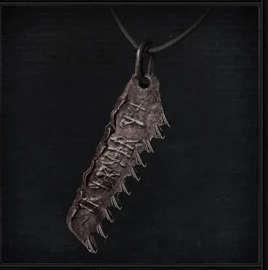
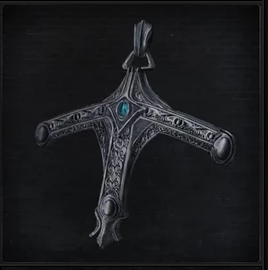
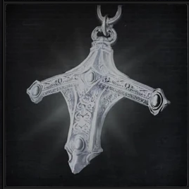
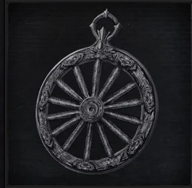
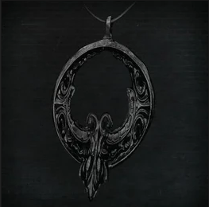
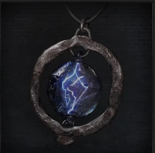
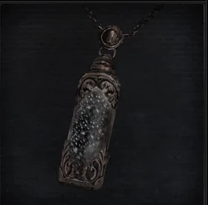

<link rel="stylesheet" href="assets/css/weaponspage.css">

## [Saw Hunter Badge](weapons/saw-hunter-weapons.md) 

## [Sword Hunter Badge](weapons/sword-hunter-weapons.md) 

## [Radiant Sword Hunter Badge](weapons/radiant-sword-hunter-weapons.md) 

## [Wheel Hunter Badge](weapons/wheel-hunter-weapons.md) 

## [Crow Hunter Badge](weapons/crow-hunter-weapons.md) 

## [Spark Hunter Badge](weapons/spark-hunter-weapons.md) 

## [Powder Keg Hunter Badge](weapons/powder-keg-hunter-weapons.md) 

[Cosmic Eye Watcher Badge]

[Cainhurst Badge]

[Firing Hammer Badge]

[Old Hunter Badge]