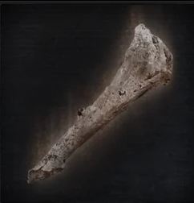
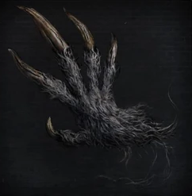
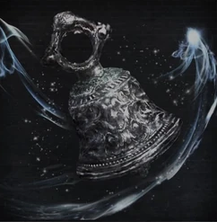
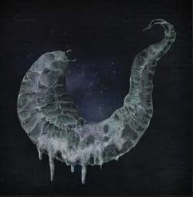
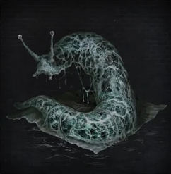
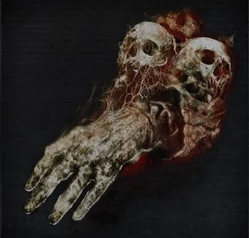
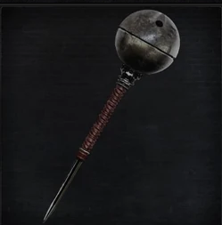
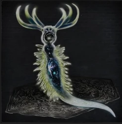

<link rel="stylesheet" href="assets/css/toolspage.css">

>## Hunter Tools
>Arcane artefacts that can be activated in battle to give hunters an unnatural edge.

>### Requirements
>Tools require a certain amount of Insight Points to use and often demand Insight Rolls to be resisted with Sanity Rolls.

>#### Old Hunter Bone 
>The bone of an old forgotten hunter. Said to be an apprentice to Gehrman and a practitioner of the art of Quickening, a technique of the first hunters.   
This tool grants the hunter that holds it a temporary access to Quickening.

>| Effect |Effect Duration  | Insight Requirement |Bullet Cost|
| --- | --- | --- |--- |
| Quickening | 1 round | 3 | 4 |

>##### Activation:
> The caster must squeeze the bone to activate the tool. Upon doing so, the effect is triggered.

>##### Quickening Effect:
This allows the hunter to dodge as a free action, without having to use a Stamina Point. Dodge Rolls are also now calculated with d20s, instead of d10s.

>#### Beast Roar 
>Forbidden tool made by Irreverent Izzy. Borrows the strength of undead darkbeasts, to blast foes back with the force of a roaring beast. The inexplainable sound is produced with the vocal cords of the caster, bringing into question what hides in the depths of men.   
This tool triggers the Beast Blast effect upon activation.

>| Effect |Effect Duration  | Insight Requirement |Bullet Cost|
| --- | --- | --- |--- |
| Beast Blast | Immediate | 3 | 2 |

>##### Activation:
>The caster emits an inhuman roar, sending a powerful blast everywhere. This tool can be activated as an extra action performed by spending 1 Stamina Point, this extra action can be performed at any point in battle.

>##### Burden
>The Hunter must roll an Insight Roll to resist with a Sanity Roll. If the Sanity Roll fails, the Hunter will gain 1 Beast Point and the beast will take over for one round.

>##### Beast Blast Effect:
>This effect applies the Knockback (BTH meters) effect to all enemies in a 6 meter radius. It also deflects projectiles being sent at the caster. Denying any ranged attacks. 

>#### Choir Bell 
>Special tool of the Choir, elite of the Church. The sound produced by this bell grants vigor and healing to all hunters nearby.   
This tool triggers the Healing Sound effect upon activation.

>| Effect |Effect Duration  | Insight Requirement |Bullet Cost|
| --- | --- | --- |--- |
| Healing Sound | Immediate | 3 | 7 |

>##### Activation:
>The caster rings the bell as a cosmic glow irradiates surrounding the caster and blue shining orbs float around the caster.

>##### Burden
>The Hunter must roll an Insight Roll to resist with a Sanity Roll. If the Sanity Roll fails, the Hunter will gain 1 Insight and be stunned for one round.

>##### Healing Sound Effect:
>This effect heals all hunters in a 6 meter radius by (ARC- BP)d8. 

>#### Empty Phantasm Shell 
>Empty invertebrate shell said to belong to a familiar of a Great One. Can be rubbed on weapons to imbue them with arcane strength.  
This tool applies the Arcane Damage effect to the hunters weapon upon activation.

>| Effect |Effect Duration  | Insight Requirement |Bullet Cost|
| --- | --- | --- |--- |
| Arcane Damage | 4 rounds | 3 | 3 |

>##### Activation:
>The caster rubs the shell on the weapon that assumes an eerie pale blue glow.

>##### Arcane Damage Effect:
>This effect adds 20 Arcane type damage to all the weapons attack, can only be applied to weapons that accept buffs. 

>#### Augur of Ebrietas 
>Remnant of the eldritch truth found by Byrgenwerth. Partially summons Ebrietas.   
This tool triggers the Cosmic Augur attack upon activation.  

>Damage Dice: d10   

>| Attack |Type  | Range | Multiplier | Modifier |Area of Effect|Effect| Insight Requirement | Bullet Cost|
| --- | --- | --- |--- |--- |--- |--- |--- |--- |
| Cosmic Augur | ARC+Insight-BP | 5 meters | x2 | +ARC | 1 enemy| Stagger: -ARC, Precise: +6, Arcane, Knockback: 4 meters| 4 | 1 |

>##### Activation:
>The caster extends their arm as a cosmic portal opens around their hand an pale tentacles spur out of the portal, extending and hitting the chosen target. The attack triggered by this tool can be used in a Parry, instead of the common firearm. In this case an ACC roll must be performed.

>##### Burden
>The Hunter must roll an Insight Roll to resist with a Sanity Roll. If the Sanity Roll fails, the Hunter will gain 1 Insight and be stunned for one round.

>#### Executioner`s Gloves 
>Secret treasure of Cainhurst, gloves passed through generations of executioners from a faraway land, these gloves summon angry spirits when smeared with blood.   
This tool triggers the Vengeful Wrath attack upon activation.  

>Damage Dice: d10   

>| Attack |Type  | Range | Multiplier | Modifier |Area of Effect|Effect| Insight Requirement | Bullet Cost
| --- | --- | --- |--- |--- |--- |--- |--- |--- |
| Vengeful Wrath | ARC+Insight-BP | 8 meters | x3 | +ARC | 1 enemy| Slow, Arcane| 5 | 3 |

>##### Activation:
>The caster raises their hands above their head, cutting their hands and pouring blood on the gloves. When done so, three red arcane skulls surge out of their palms that float over to the target selected by the caster.

>##### Burden
>The Hunter must take (BLT+Insight)d4 damage when activating this hunter tool.

>#### Tiny Tonitrus 
>Smaller but similar to the tonitrus, this special mace recreates the blue sparks of darkbeasts when struck into the ground.   
This tool triggers the Darkbeast Lightning attack upon activation.  

>Damage Dice: d12   

>| Attack |Type  | Range | Multiplier | Modifier |Area of Effect|Effect| Insight Requirement | Bullet Cost
| --- | --- | --- |--- |--- |--- |--- |--- |--- |
| Darkbeast Lightning | ARC+Insight-BP | 14 meters | x2 | +ARC | 6 enemies in line| Bolt, Strong: +2 | 6 | 6 |

>##### Activation:
>The caster smashes the mace into the ground summoning a barrage of lightning bolts in a single line at great speed, flowing from the ground and surging up into towers of blue sparks.

>##### Burden
>The Hunter must roll an Insight Roll to resist with a Sanity Roll. If the Sanity Roll fails, the Hunter will gain 1 Insight Point and his round will immediately end.

>#### A Call Beyond 
>Secret rite of the Choir, this rite, once used to reach a new plane of darkness, now summons an exploding star.   
This tool triggers the Call Beyond attack upon activation.   

>Damage Dice: d20   

>| Attack |Type  | Range | Multiplier | Modifier |Area of Effect|Effect| Insight Requirement | Bullet Cost
| --- | --- | --- |--- |--- |--- |--- |--- |--- |
| Call Beyond| ARC+Insight | 8 meter radius | x2 | +ARC | 20 enemies| Arcane, Strong: +5 | 7 | 7 |

>##### Activation:
>The caster lifts his hands above his head as several arcane orbs emerge from a dark cosmic portal, they explode hitting all targets.

>##### Burden
>The Hunter must roll an Insight Roll to resist with a Sanity Roll. If the Sanity Roll fails, the Hunter will gain 2 Insight Points.
