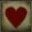
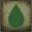
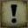

<link rel="stylesheet" href="./assets/css/thehunterpage.css">

>## Attributes
>### Vitality (VIT) 
>This statistic represents your will to live and keep fighting despite injuries.
Attributes influenced by Vitality: Health Points.   
Level 1: the usual self preservation instinct, however most people will perish when faced with the beasts.   
Level 3: expected of veteran hunters or individuals who have had to fight to stay alive, having survived many close calls.   
Level 5: places the hunter above the rest as they are determined to see the night through alive.
>#### Health Points (HP)
>Represents your current will to keep going in that moment.   
Health Points (HP) = Vitality * 10   
HP are lost when you suffer damage, they can be regained through healing.
>### Endurance (END) 
>This statistic represents your physical capacity and mental resilience in front of pain or anguish.   
Attributes influenced by Endurance: Stamina Points , Sanity Level and Initiative.   
Level 1: the basic human standard in body tenacity and mental strength, one found in a normal person that never had any form of specialized training neither had any encounters with the eldritch truth.   
Level 3: the physical and mental acuity of a seasoned hunter or survivor, skilled in dealing with all sorts of adversities.   
Level 5: peak form of human strength and presence and individual that through the hardships of blood and truth managed to find the buried inner strength to endure it all.
>#### Stamina Points (SP)
>Allows you to outperform yourself, performing extra actions or special actions in battle.   
Stamina Points = Endurance * 3   
Most hunters can only use one Stamina Point per round, not being able to use it again in Battle after all points are spent. Once the foe is killed and the Battle is finished, all Stamina Points are replenished.
>### Accuracy (ACC) 
>This statistic represents your capacity to hit targets in the midst of turmoil. It is used in Battle to determine critical hits, parries and perform regular attacks.    
Attributes influenced by Accuracy: Hit Roll    
Level 1: aim of a peasant with a wooden slingshot.   
Level 3: a skilled marksman or fencer.   
Level 5: peak marksmanship and excellent combat prowess.
>#### Hit Roll:
>Hit Roll = (Accuracy)d10
>### Skill (SKL) 
>This statistic represents your hunter`s skill in battle, specially when using skill-based weapons. It also defines your reaction time.   
Attributes influenced by Skill: Initiative, Visceral Damage and Defense.   
Level 1: the skill it takes to cut a piece of meat to grill.   
Level 3: capacity to cut the proper artheries and joints in order to incapacitate an opponent.   
Level 5: every strike is planned, a lethal movement heading towards the inevitable end of the beast being dismantled.
>#### Initiative (INIT)
>Determines who is going first in Battle based on ones reaction speed.    
Initiative = (SKL + END)d10   
All hunters roll initiative in the beggining of a Battle.
>#### Visceral Damage (VISC)
>When a foe has their guard broken, the hunter can roll skill to determine the damage done.   
Visceral Damage = (SKL)d10 x4
>### Strength (STR) 
>This statistic represents your hunter`s physical strength and muscle tenacity, allowing him to wield abnormally heavy or cumbersome weapons with ease.   
Attributes influenced by Strength: Guard Level and Defense   
Level 1: the strength necessary to carry a pack of beans.   
Level 3: allows the hunter to move many pounds of steel quickly while dealing ground breaking attacks.    
Level 5: a strike performed by a hunter with the proper weapon and this level of strength will crush even the strongest beast.
>#### Defense (DEF)
>This determines how hard you are to hit, be it because of how nimble you are or how resistance and tough you are.   
Defense = Initial Class Value + max(STR,SKL) per level.   
Enemies must get a ACC roll equal or higher than your defense in order to hit you. Some attacks from enemies can have ACC modifiers, making them harder to avoid.
>#### Guard Level (GUARD)
>Determines your capacity to maintain your fighting stance in Battle.   
Guard Points = Class Initial Value + STR value per level   
If a foe does more damage than your GUARD, your guard will be broken, leading you suscetible to double damage or a visceral attack.
>### Bloodtinge (BLT) 
>This statistic represents the quality of your blood. As many descendants of the elder blood have partaken in blood communion, the bloodtinge has wained through the generations. Those who still uphold high bloodtinge can infuse the blood in their quicksilver bullets to deal intoxicating damage to the beasts while also being capable of healing other hunters with their high quality blood.   
Attributes influenced by Bloodtinge: Ranged Damage, Blood Communion Level and Blood Drunkeness   
Level 1: your blood is poor and thin, like that of a blood craving peasant.   
Level 3: your blood could make a man sick, so intoxicating.   
Level 5: descendant of the ancient pthumerians, or maybe the loran, your blood is old and unique, a one of a kind, keep it a secret.
>#### Ranged Damage (RD)
>Defines the strength of your blood infused quicksilver bullets.   
Ranged Damage = (BLT)d10   
Is rolled every time a shot is fired.
>#### Blood Communion Level (BC)
>Determines your capacity to heal others.   
Blood Communion Level = (1d10 + BLT) per 5 HP sacrificed.   
When you wish to give communion to a fellow hunter, you shall sacrifice 5 HP per each d10 you wish to roll. The sum of the rolls will result in the amount of HP healed from your colleague, however you can only roll a maximum of BLT rolls per round. The hunter healed will experience the effects of Blood Drunkeness. 
>#### Blood Drunkeness (BD)
>Determines your resistance to the inebriating quality of blood and the thirsting beast inside.   
Blood Drunkeness = (BLT from the blood received - BLT from the hunter healed)d10    
The hunter must roll for Blood Drunkeness with the amount of d10 equal to the difference of the bloodtinge from the blood received and the bloodtinge of the hunter who partook in communion. After this, the hunter must perform a Sanity Roll, should the Sanity Roll be inferior to the Blood Drunkeness Roll, the hunter will be taken by the Beast for one round and they will receive one Beast Point.
>### Arcane (ARC) 
>This statistic represents your understanding of the eldritch truth and the nature of the cosmos. How many eyes on the insight does the hunter possess.   
Attributes influenced by Arcane: Sanity Level and Insight   
Level 1: you are thinking on the basest of planes, so blinded and ignorant, blessed.   
Level 3: a scholar who knows many secrets, careful for they shall haunt you.    
Level 5: you see more than anyone should, may the great ones have mercy on your mind.
>#### Sanity Level (SL)
>Determines your capacity to resist Blood Drunkeness and the Eldritch Truth.   
Sanity Level = (ARC + END)d10   
Once exposed to the eldritch truth or the intoxication of the blood, a hunter must do a Sanity Roll.   
A Sanity Roll is successful if it is equal or higher than the Roll being resisted.
>#### Insight (IS) 
>Insight = 0/10   
When exposed to the eldritch truth, you gain unholy insight into the Kosm.   
Hunters can perform Insight Rolls willingly to gain divine knowledge upon their foes and mysteries, however those shall also be resisted sanity-wise.   
Insight Roll = (Insight)d10   
Whenever a hunter is exposed to the eldritch truth, they must perform a Insight Roll, then resist it with a Sanity Roll,should they fail they will be stunned for one round if in Battle and will also gain one point of Insight.   
When a hunter gains Insight with an empty Beast Point bar, they will have the Beast Point maximum permanently reduced by 1.
>### Beasthood (BTH) 
>This represents how much your hunter has embranced the beast within, heeding the call of the old blood.
Attributes influenced by Beasthood: Beast Damage, Beast Points.   
Level 1: you thirst for the old blood, but you can contain yourself.   
Level 3: the blood calls to you, it makes all the pain go away, more blood.    
Level 5: there is only blood and where is blood are the beasts, scurrying away shyly to drink it out of the corpse filled floor, fear the old blood.
>#### Beast Damage (BD)
>Once the hunter has any Beast Point, they can willingly choose to do Beast Damage instead of the regular type of damage from their weapon, by allowing the beast to push through temporarily. This however triggers a Beast Roll the hunter must resist, lest they lose control.   
Beast Damage = Attack Damage + (BTH)d10
>#### Beast Points (BP)
>Beast Points = 0/10   
Most hunters start with no Beast Points, but as the beast creeps in, they turn.    
For each Beast Point possessed, the hunter can spend an additional Stamina Point (SP) per round.   
Should they choose to do Beast Damage, they must perform a Beast Roll:   
Beast Roll = (Beast Points)d10   
Afterwards, they must resist the Beast Roll with a Sanity Roll, should the Sanity Roll be inferior, the Beast will take over for one round and another Beast Point will be added.   
If a hunter gains a Beast Point with their Insight Meter empty, their Insight Maximum will be permanently reduced by 1.
