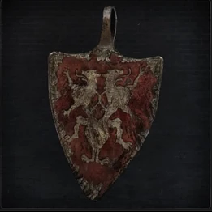
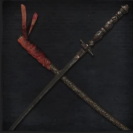
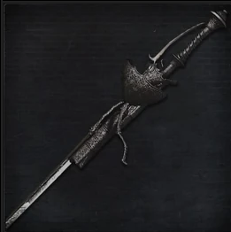
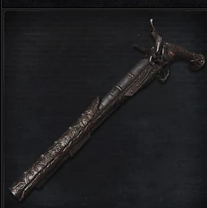

<link rel="stylesheet" href="../assets/css/weaponspage.css">

>## Cainhurst Badge 
>Badge of the Royal Guards of Cainhurst. The vilebloods are hunters of blood and hunt prey in search of blood dregs.

>### Acquisition
>It can be acquired by killing a level 3 or higher Hunter.

>#### Chikage 
>Foreign weapon used by the Royal Guards of Annalise, Queen of the Vilebloods. The intricate engraving that spans the blade, when imbued with blood, causes the sword to sing in scarlet hues. This eats away at the essence of the wielder.  

>Buffs cannot be applied.   

>Damage Dice: d10    

>Standard Form:   

>| Attacks |Type  | Range | Multiplier | Modifier |Area of Effect|Effect
| --- | --- | --- |--- |--- |--- |--- |
| Cut | SKL | 1 meter | x2 | +SKL | 2 adjacent enemies| -- |
| Pierce | SKL | 2 meter | x3 | 0 | 1 enemy | -- |
| Charged Pierce | SKL | 2 meters | x2 | 0 | 1 enemy | --|
| Switch Unsheath | BLT | 1 meters | x3 | +BLT | 3 adjacent enemies | Blood, Rapid Poison:3|

>Imbued Form:   

>Two-Handed.   

>While in this form, the hunter suffers 3d4 health loss per round. The Unsheath attacks if performed increase this to 4d6 on the round in which the attack was performed. 

>| Attacks |Type  | Range | Multiplier | Modifier |Area of Effect|Effect
| --- | --- | --- |--- |--- |--- |--- |
| Cut | BLT | 1 meter | x2 | +BLT | 2 adjacent enemies| Blood, Rapid Poison:2 |
| Unsheath | BLT | 1 meter | x4 | 0 | 3 adjacent enemies | Blood, Rapid Poison:3, Strong: +2|
| Charged Unsheath| BLT | 1 meter | x4 | +BLT | 3 adjacent enemies | Blood, Rapid Poison:3, Strong: +3 |
| Pierce| BLT | 2 meters | x2 | +BLT | 1 enemy | Blood, Rapid Poison:1 |
| Switch Cut| BLT | 1 meter | x3 | +BLT | 2 adjacent enemies | Blood, Rapid Poison:2 |

>#### Reiterpallasch 
>Wielded by the Knights of Cainhurst, it combines an elegant knightly sword with a peculiar fiream.   

>Buffs can be applied.   

>Damage Dice: d8    

>Rapier Form:

>| Attacks |Type  | Range | Multiplier | Modifier |Area of Effect|Effect | Bullet Cost|
| --- | --- | --- |--- |--- |--- |--- | --- |
| Thrust | SKL| 2 meters | x2 | +SKL | 1 enemy |Chain| 0 |
| Cut | SKL| 1 meter | x2 | +SKL | 2 adjacent enemies |Chain| 0 |
|Charged Thrust| SKL| 2 meters | x3 | +SKL | 1 enemy |Chain| 0 |
|Switch Shot| BLT | 10 meters | x3 | +SKL | 1 enemy | Fast, Blood | 1 |

>Parthian Rapier Form:

>| Attacks |Type  | Range | Multiplier | Modifier |Area of Effect|Effect | Bullet Cost|
| --- | --- | --- |--- |--- |--- |--- | --- |
| Thrust | SKL| 1 meter | x2 | +SKL | 1 enemy |Chain| 0 |
|Shot| BLT | 10 meters | x3 | +SKL | 1 enemy | Fast, Precise:+5, Blood | 1 |

>#### Evelyn 
>Special pistol used by Cainhurst Knights.  
Damage Dice: d6    

>| Attacks |Type  | Range | Multiplier | Modifier |Area of Effect|Effect | Bullet Cost|
| --- | --- | --- |--- |--- |--- |--- | --- |
| Shot | BLT| 3 meters | 18/x4 | +BLT | 1 enemy |Blood| 1 |