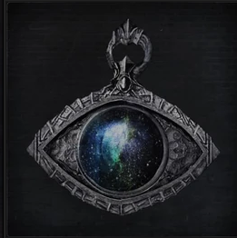
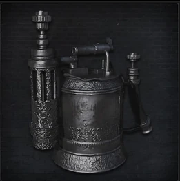

<link rel="stylesheet" href="../assets/css/weaponspage.css">

>## Cosmic Eye Watcher Badge 
>Badge created by a member of the Choir, elite of the Healing Church. The eye represents the very cosmos.

>### Acquisition
>It can be acquired by killing a level 2 Kin.

>#### Rosmarinus 
>Special weapon used by the Choir, is sprays a cloud of sacred mist, using blood as a special medium.  

>Damage Dice: d3   

>| Attacks |Type  | Range | Multiplier | Modifier |Area of Effect|Effect | Bullet Cost|
| --- | --- | --- |--- |--- |--- |--- | --- |
| Spray | ARC| 3 meters | 18/x2 | 0 | 6 adjacent enemies |Arcane| 1 |