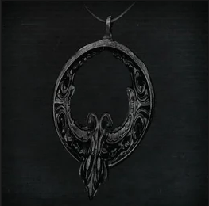

<link rel="stylesheet" href="../assets/css/weaponspage.css">

>## Crow Hunter Badge 
>Belongs to a hunter of hunters, they hunt those that have become blood addled, passed by from generation to generation, this badge comes with the burden of resisting the seduction of blood and being honorable when taking a comrade`s life.

>### Acquisition
>It can be acquired by killing a level 2 Hunter.

>#### Blade of Mercy 
>One of the oldest weapons of the workshop, used by the Hunters of Hunters.  

>Buffs cannot be applied.   

>Shortsword Form:   

>Damage Dice: d8   

>| Attacks |Type  | Range | Multiplier | Modifier |Area of Effect|Effect
| --- | --- | --- |--- |--- |--- |--- |
| Swing | SKL | 1 meter | x2 | +SKL | 2 adjacent enemies| Fast |
| Charged Cut | SKL | 1 meter | x2 | 0 | 1 enemy | -- |
| Switch Swing| SKL| 1 meter | x3 | +SKL | 2 adjacent enemies | Fast|

>Twin Daggers Form:   

>Damage Dice: d4   

>Two-Handed.   

>| Attacks |Type  | Range | Multiplier | Modifier |Area of Effect|Effect
| --- | --- | --- |--- |--- |--- |--- |
| Swing | SKL | 1 meter | x2 | +SKL | 1 enemy| Fast, Chain|
| Bilateral Cut | SKL | 1 meter | x3 | +SKL | 1 enemy | Fast, Light|

