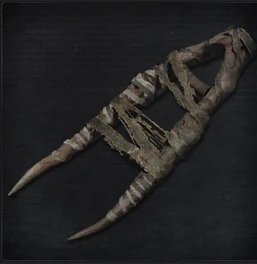

<link rel="stylesheet" href="../assets/css/weaponspage.css">

>## Old Hunter Badge 
>Crafted in the time of Gehrman, this badge was a special privilege for hunters of the past, it represents the will of those that came before.

>### Acquisition
>It can be acquired by killing a level 5 or higher Beast or a level 5 or higher Hunter.

>#### Burial Blade 
>Masterpiece that defined all trick weapons made in the workshop, its blade of siderite is said to have fallen from the heavens.  

>Buffs cannot be applied.   

>Damage Dice: d12    

>Curved Sword Form:   

>| Attacks |Type  | Range | Multiplier | Modifier |Area of Effect|Effect
| --- | --- | --- |--- |--- |--- |--- |
| Cut | SKL | 1 meter | x3 | +SKL | 2 adjacent enemies| Rally:+(SKL+ARC) |
| Smash | SKL | 1 meter | x3 | 0 | 1 enemy | Stagger: -SKL |
| Charged Cut | SKL | 1 meter | x3 | +SKL | 2 adjacent enemies | Rally:+SKL|
| Switch Cut | SKL | 4 meters | x3 | +SKL | 3 adjacent enemies |Rally:+(SKL+ARC), Knockback: 3 meters|

>Scythe Form:   

>Two-Handed.   

>| Attacks |Type  | Range | Multiplier | Modifier |Area of Effect|Effect
| --- | --- | --- |--- |--- |--- |--- |
| Cut | SKL | 4 meters | x3 | SKL |6 adjacent enemies| Rally:+(SKL+ARC) |
| Smash Pierce | SKL | 4 meters | x4 | 0 |1 enemy |Stagger: -(SKL+ARC)|
| Sweep| SKL | 4 meters | x4 | +ARC | 6 adjacent enemies| Rally:+(SKL+ARC) |
| Charged Sweep| SKL | 4 meters | x4 | +ARC | 6 adjacent enemies | Rally:+(SKL+ARC), Knockback: 6 meters |
| Switch Cut| SKL | 1 meter | x3 | +ARC | 2 adjacent enemies | Rally: +SKL, Chain |

>#### Beast Claw 
>Wielded by the Knights of Cainhurst, it combines an elegant knightly sword with a peculiar fiream.   

>Buffs can be applied.   

>Damage Dice: d10    

>Claw Form:

>| Attacks |Type  | Range | Multiplier | Modifier |Area of Effect|Effect |
| --- | --- | --- |--- |--- |--- |--- |
| Slash | STR| 1 meters | x2 | +STR | 2 adjacent enemies |Chain|
| Thrust | STR| 1 meter | x2 | +STR | 1 enemy |Chain|
|Charged Thrust| STR| 2 meters | x3 | +STR | 1 enemy |--|

>Beast Form:

>Two-Handed.   

>| Attacks |Type  | Range | Multiplier | Modifier |Area of Effect|Effect |
| --- | --- | --- |--- |--- |--- |--- |
| Slash | BTH | 1 meter | x3 | +BTH | 2 adjacent enemies |Chain, Fast, Scourge, Scourge Affinity: -3|
|Pound| BTH | 1 meter | x3 | +BTH | 1 enemy |Scourge, Scourge Affinity: -3, Knockback: 2 meters|
|Charged Smash| BTH | 1 meter | x3 | +BTH | 1 enemy |Scourge, Scourge Affinity: -3, Knockback: 2 meters, Stagger: -BTH, Strong: +2|