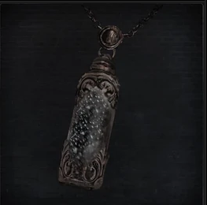

<link rel="stylesheet" href="../assets/css/weaponspage.css">

>## Powder Keg Hunter Badge 
>Crafted by the Powder Kegs, heretics of the workshop. The Powder Kegs adored a complex design with a big boom, the late Powder Kegs had a motto: "If a weapon aint got a kick, it just aint worth it".

>### Acquisition
>It can be acquired by killing a level 3 or higher Beast type enemy.

>#### Stake Driver 
>Trick weapon created by the Powder Kegs, preferred by Djura. It gives strong attacks but leaves the user opened.  

>Buffs can be applied.   

>Damage Dice: d10    

>Standard Form:   

>| Attacks |Type  | Range | Multiplier | Modifier |Area of Effect|Effect
| --- | --- | --- |--- |--- |--- |--- |
| Swing | SKL | 2 meters | x2 | +SKL | 2 adjacent enemies|-- |
| Charged Smash | STR | 2 meters | x2 | +STR | 1 enemy | Stagger: -STR , Strong:+1|
| Switch Swing | SKL | 2 meters | x3 | 0 | 2 adjacent enemies| --|

>Loaded Form:   

>| Attacks |Type  | Range | Multiplier | Modifier |Area of Effect|Effect
| --- | --- | --- |--- |--- |--- |--- |
| Pierce | SKL | 1 meters | x2 | +SKL | 1 enemy| Stagger: -STR|
| Charged Switch Explosive Pierce | 18/STR | 1 meters | x4 | +STR | 1 enemy |Stagger: -STR, Strong:+4, Slow|

>#### Rifle Spear 
>Trick weapon created by the Powder Kegs. Prototype weapon serving as firearm and spear, an imitation of an old lost Cainhurst weapon.  

>Buffs can be applied.   

>Damage Dice: d6    

>Spear Form:   

>| Attacks |Type  | Range | Multiplier | Modifier |Area of Effect|Effect | Bullet Cost|
| --- | --- | --- |--- |--- |--- |--- |--- |
| Thrust | SKL | 4 meters | x2 | +SKL | 1 enemy|-- | 0 |
| Charged Thrust | SKL | 4 meters | x3 | +SKL | 1 enemy | --| 0 |
| Swing | SKL | 3 meters | x2 | 0 | 2 adjacent enemies| --| 0 |
| Switch Shot | BLT | 6 meters | x3 | + SKL | 4 adjacent enemies | -- | 1 | 

>Rifle Form:   

>Two-Handed.   

>| Attacks |Type  | Range | Multiplier | Modifier |Area of Effect|Effect | Bullet Cost|
| --- | --- | --- |--- |--- |--- |--- |--- |
| Thrust | SKL | 4 meters | x2 | +SKL | 1 enemy|-- | 0 |
| Charged Thrust | SKL | 6 meters | x3 | +SKL | 1 enemy | --| 0 |
| Swing | SKL | 3 meters | x2 | 0 | 2 adjacent enemies| --| 0 |
| Shot | BLT | 6 meters | x2 | 0 | 4 adjacent enemies| --| 1 |
| Switch Swipe | SKL | 4 meters | x3 | 0 | 6 adjacent enemies| --| 0 |

>#### Cannon 
>Large prototype firearm fashioned by the workshop heretics, the Powder Kegs. This monstrosity is extremely heavy and packs a crazy kick.   
>Damage Dice: d20    

>| Attacks |Type  | Range | Multiplier | Modifier |Area of Effect|Effect | Bullet Cost|
| --- | --- | --- |--- |--- |--- |--- | --- |
| Shot | BLT| 10 meters | x2 | +STR | all enemies in a 6 meter radius |--| 12 |