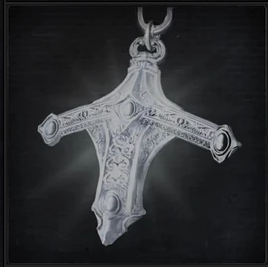

<link rel="stylesheet" href="../assets/css/weaponspage.css">

>## Saw Hunter Badge 
>The hunters know as the Holy Blades are an ancient line of heroes that date back to an age of honor and chivalry, the badge represents the will of Ludwig.

>### Acquisition
>It can be acquired by killing a level 4 or higher Beast type enemy or an level 2 Vileblood.

>#### Ludwig`s Holy Blade 
>Typically used by Healing Church hunters. It is said that this silver blade was used by Ludwig, the first church hunter. When transformed, the blade combines with its sheath to become a greatsword.  

>Buffs can be applied.   

>Sword Form:   
Damage Dice: d10    

>| Attacks |Type  | Range | Multiplier | Modifier |Area of Effect|Effect
| --- | --- | --- |--- |--- |--- |--- |
| Sweep | STR | 1 meter | x2 | +SKL | 2 adjacent enemies| Righteous |
| Strike | STR | 1 meter | x2 | +SKL | 1 enemy | Righteous |
| Pierce | STR | 2 meter | x3 | 0 | 1 enemy | Righteous |
| Charged Pierce | STR | 2 meters | x2 | 0 | 1 enemy | Righteous |
| Switch Smash | STR | 3 meters | x3 | +STR | 1 enemy | Righteous, Strong: +1|

>Greatsword Form:   
Damage Dice: d12    

>| Attacks |Type  | Range | Multiplier | Modifier |Area of Effect|Effect
| --- | --- | --- |--- |--- |--- |--- |
| Sweep | STR | 3 meters | x2 | +STR | 4 adjacent enemies| Stagger: -STR, Strong:+1d10, Righteous, Scourge Affinity: -2|
| Smash | STR | 3 meters | x3 | 0 | 1 enemy |Stagger: -STR, Strong:+2, Righteous|
| Heavy Pierce| STR | 4 meters | x3 | +STR | 1 enemy |Strong:+2, Righteous|
| Charged Pierce| STR | 4 meters | x3 | +STR | 1 enemy |Strong:+1, Righteous|

>#### Ludwig`s Rifle 
>Once used by Ludwig, this rifle has a long heavy barrel in spite of its slow reload speed.   
Damage Dice: d6    

>| Attacks |Type  | Range | Multiplier | Modifier |Area of Effect|Effect | Bullet Cost|
| --- | --- | --- |--- |--- |--- |--- | --- |
| Shot | BLT| 10 meters | x2 | 0 | 4 adjacent enemies |--| 1 |

>#### Flamesprayer 
>Used by Healing Church hunters. Uses quicksilver bullets to spit searing fire. Useful against beasts.  
Damage Dice: d3    

>| Attacks |Type  | Range | Multiplier | Modifier |Area of Effect|Effect | Bullet Cost|
| --- | --- | --- |--- |--- |--- |--- | --- |
| Spray | ARC| 3 meters | 18/x2 | 0 | 6 adjacent enemies |Fire| 1 |