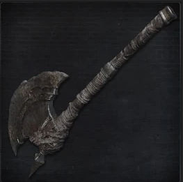
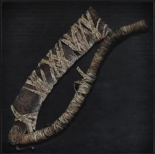
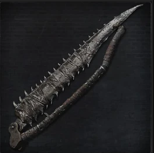
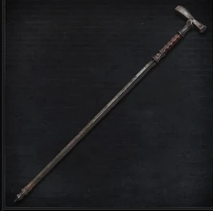
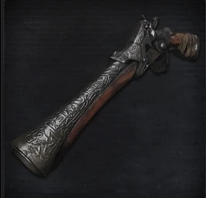
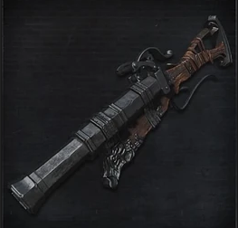

<link rel="stylesheet" href="../assets/css/saw-hunter-weapons.css">

>## Saw Hunter Badge
>This badge represents the prowess one possesses at hunting and slaying beasts.

>### Acquisition
>It can be acquired by killing a level 3 or higher Beast type enemy.

>#### Hunter Axe 
>An axe commonly used on the hunt. It has high rally potential and also gives great crowd control attacks when transformed.  

>Hand Axe Form:   

>| Attacks |Type  | Range | Multiplier | Modifier |Area of Effect|Effect
| --- | --- | --- |--- |--- |--- |--- |
| Vertical Swing | STR | 1 meter | x2 | 0 | 1 enemy| Rally increase : +STR to Rally|
| Horizontal Swing | STR | 1 meter | x2 | 0 | 2 adjacent enemies | Rally increase : +STR to Rally|
| Smash | STR | 1 meter | x2 | +STR | 1 enemy | Stagger: -STR to enemy guard|
| Charged Smash | STR | 1 meter | x2 | 0 | 1 enemy | Stagger: -STR to enemy guard|
| Piercing Uncoil | STR | 4 meters | x3 | 0 | 1 enemy | Transform|

>Halberd Form:   

>| Attacks |Type  | Range | Multiplier | Modifier |Area of Effect|Effect
| --- | --- | --- |--- |--- |--- |--- |
| Sweep | STR | 3 meters | x2 | 0 | 4 adjacent enemies| Rally increase : +STR to Rally|
| Long Smash | STR | 3 meters | x2 | +STR | 1 enemy |Stagger: -STR to enemy guard|
| Piercing Switch| STR | 4 meters | x3 | +SKL | 1 enemy | --|
| Charged Spin | STR | 3 meters | x2 | 0 | 8 enemies| Stagger: -STR to enemy guard, Knockback: 3 meters|

>#### Saw Cleaver 
>An effective saw at drawing the blood of beasts, it transforms into a long cleaver. It is a symbol of the hunt against beasts.  

>Saw Form:   

>| Attacks |Type  | Range | Multiplier | Modifier |Area of Effect|Effect
| --- | --- | --- |--- |--- |--- |--- |
| Swing | SKL | 1 meter | x3 | 0 | 2 adjacent enemies | Serrated |
| Charged Swing | STR | 1 meter | x2 | 0 | 1 enemy | Serrated|
| Switch Swing | SKL | 2 meters | x3 | +SKL | 1 enemy | --|

>Cleaver Form:   

>| Attacks |Type  | Range | Multiplier | Modifier |Area of Effect|Effect
| --- | --- | --- |--- |--- |--- |--- |
| Sweep | SKL | 2 meters | x2 | 0 | 2 adjacent enemies| -- |
| Downward Smash | STR | 2 meters | x2 | +STR | 1 enemy |Stagger: -STR to enemy guard|
| Charged Sweep| STR | 2 meters | x2 | +SKL | 2 adjacent enemies |Stagger: -STR to enemy guard, Knockback: 2 meters|

>#### Saw Spear 
>This saw, effective at drawing blood from beasts, transforms into a medium-range spear.  

>Saw Form:   

>| Attacks |Type  | Range | Multiplier | Modifier |Area of Effect|Effect
| --- | --- | --- |--- |--- |--- |--- |
| Swing | SKL | 1 meter | x3 | 0 | 2 adjacent enemies | Serrated |
| Charged Swing | SKL | 1 meter | x2 | 0 | 1 enemy | Serrated|
| Switch Swing | SKL | 3 meters | x3 | +SKL | 1 enemy | Serrated|

>Spear Form:   

>| Attacks |Type  | Range | Multiplier | Modifier |Area of Effect|Effect
| --- | --- | --- |--- |--- |--- |--- |
| Sweep | SKL | 3 meters | x2 | 0 | 2 adjacent enemies| Serrated |
| Downward Smash | SKL | 3 meters | x2 | +STR | 1 enemy |Serrated|
| Charged Sweep| SKL | 3 meters | x2 | 0 | 2 adjacent enemies |Stagger: -STR to enemy guard, Knockback: 2 meters, Serrated|

>#### Threaded Cane 
>A deadly strong bladed cane, that serves as a serrated whip when transformed.   

>Cane Form:   

>| Attacks |Type  | Range | Multiplier | Modifier |Area of Effect|Effect
| --- | --- | --- |--- |--- |--- |--- |
| Side Strike | SKL | 1 meter | x2 | 0 | 1 enemy | Righteous|
| Pierce | SKL | 2 meters | x2 | 0 | 1 enemy | Righteous|
| Charged Pierce | SKL | 2 meters | x2 | +SKL | 1 enemy | Righteous|
| Switch Head Swing | SKL | 4 meters | x3 | +SKL | 1 enemy | Righteous|

>Whip Form:   

>| Attacks |Type  | Range | Multiplier | Modifier |Area of Effect|Effect
| --- | --- | --- |--- |--- |--- |--- |
| Sweep | SKL | 4 meters | x2 | 0 | 6 adjacent enemies| Serrated |
| Piercing Swing | SKL | 4 meters | x3 | +SKL | 1 enemy |Serrated|

>#### Hunter`s Pistol 
>Pistols made at the workshop for hunters stalking beasts. Uses quicksilver bullets to inflict damage.   

>| Attacks |Type  | Range | Multiplier | Modifier |Area of Effect|Effect | Bullet Cost|
| --- | --- | --- |--- |--- |--- |--- | --- |
| Shot | BLT| 10 meters | x2 | 0 | 1 enemy | --| 1 |

>#### Hunter`s Blunderbuss 
> A Blunderbuss created at the workshop for hunters. The impact and widespread effect is guaranteed to be effective.

>| Attacks |Type  | Range | Multiplier | Modifier |Area of Effect|Effect | Bullet Cost|
| --- | --- | --- |--- |--- |--- |--- | --- |
| Shot | BLT| 6 meters | x2 | 0 | 4 adjacent enemies | --| 1 |
