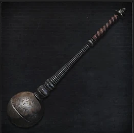

<link rel="stylesheet" href="../assets/css/weaponspage.css">

>## Spark Hunter Badge 
>Create in secret by Archibald, eccentric inventor of the Healing Church, he was fascinated in reproducing the eletric sparks produced by the hides of darkbeasts, his studies closely, incidentally, closely followed the methodology of Byrgenwerth.

>### Acquisition
>It can be acquired by killing a level 2 Darkbeast.

>#### Tonitrus 
>Created by Archibald, this weapon is a mace that when struck generates the same blue sparks that blanket a darkbeast  

>Buffs cannot be applied.   

>This weapon returns to its standard form after 2 rounds.  

>Damage Dice: d6   

>Standard Form:   

>| Attacks |Type  | Range | Multiplier | Modifier |Area of Effect|Effect
| --- | --- | --- |--- |--- |--- |--- |
| Strike | STR | 1 meter | x2 | +STR | 1 enemy| -- |
| Charged Swing | STR | 1 meter | x2 | 0 | 2 adjacent enemies | -- |
| Switch Strike| ARC| 1 meter | x3 | +ARC | 1 enemy | Bolt|

>Imbued Form:   

>| Attacks |Type  | Range | Multiplier | Modifier |Area of Effect|Effect
| --- | --- | --- |--- |--- |--- |--- |
| Strike | ARC | 1 meter | x3 | +STR | 1 enemy| Bolt|
| Charged Swing | ARC | 1 meter | x2 | +STR | 2 adjacent enemies | Bolt|