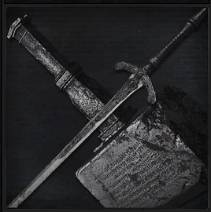
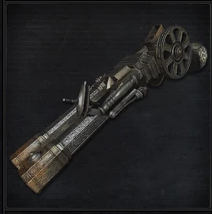

<link rel="stylesheet" href="../assets/css/sword-hunter-weapons.css">

>## Sword Hunter Badge 
>Badge created by the Healing Church. The silver sword is a symbol of the Church.

>### Acquisition
>It can be acquired by killing a level 3 or higher Beast type enemy.

>#### Kirkhammer 
>Typically used by Healing Church hunters. An easily handled silver sword that can turn into a giant obtuse weapon, with extreme force of impact.  

>Sword Form:   

>| Attacks |Type  | Range | Multiplier | Modifier |Area of Effect|Effect
| --- | --- | --- |--- |--- |--- |--- |
| Sweep | STR | 1 meter | x2 | +SKL | 2 adjacent enemies| Righteous |
| Strike | STR | 1 meter | x2 | +SKL | 1 enemy | Righteous |
| Pierce | STR | 2 meter | x3 | 0 | 1 enemy | Righteous |
| Charged Pierce | STR | 2 meter | x2 | 0 | 1 enemy | Righteous |
| Switch Smash | STR | 1 meter | x3 | +STR | 1 enemy | Righteous|

>Greathammer Form:   

>| Attacks |Type  | Range | Multiplier | Modifier |Area of Effect|Effect
| --- | --- | --- |--- |--- |--- |--- |
| Sweep | STR | 3 meters | x2 | +STR | 4 adjacent enemies| Stagger: -STR to enemy guard|
| Smash | STR | 3 meters | x3 | 0 | 1 enemy |Stagger: -STR to enemy guard|
| Charged Smash| STR | 4 meters | x2 | +STR | 1 enemy | Stagger: -STR to enemy guard|

>#### Revolving Pistol 
>A revolving pistol with a complex design, it shoots two bullets at once.   

>| Attacks |Type  | Range | Multiplier | Modifier |Area of Effect|Effect | Bullet Cost|
| --- | --- | --- |--- |--- |--- |--- | --- |
| Shot | BLT| 10 meters | 9/x3 | 0 | 1 enemy |--| 2 |