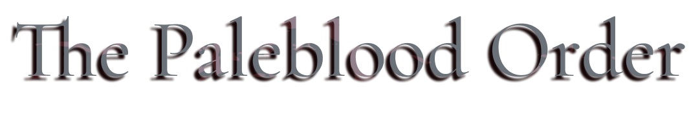

<link rel="stylesheet" href="../assets/css/weaponspage.css">

>## Wheel Hunter Badge 
>The executioners were a band of hunters led by Martyr Logarius inspired by a hevay fanaticism and mystical beliefs, dedicating their lifes to a unique brand of justice. The wheel symbolizes righteous destiny.

>### Acquisition
>It can be acquired by killing a level 3 Vileblood.

>#### Logarius Wheel 
>Used to slaughter the vilebloods of Cainhurst, bathing in their blood and ire. Transforming releases the rage of the wheel in a show of utter brilliance as the vileblood tortured souls scream in anger.  

>Buffs cannot be applied.   

>Damage Dice: d12    

>Standard Form:   

>| Attacks |Type  | Range | Multiplier | Modifier |Area of Effect|Effect
| --- | --- | --- |--- |--- |--- |--- |
| Smash | STR | 1 meter | x2 | +STR | 1 enemiy| Righteous, Stagger: -STR |
| Charged Spin | STR | 1 meter | x2 | +STR | 6 adjacent enemies | Righteous, Knockback: 3 meters |
| Switch Smash | ARC | 1 meter | x2 | +ARC | 1 enemy | Righteous, Stagger: -STR, Strong: +3, Arcane|

>Imbued Form:   

>Two-Handed.   

>| Attacks |Type  | Range | Multiplier | Modifier |Area of Effect|Effect
| --- | --- | --- |--- |--- |--- |--- |
| Smash | ARC | 1 meter | x2 | +STR | 1 enemy|Arcane, Strong:+1, Righteous,Stagger: -STR|
| Swing | ARC | 1 meter | x2 | 0 | 1 enemy |Stagger: -STR, Strong:+2, Righteous, Arcane|
| Charged Smash| ARC | 1 meter | x3 | +STR | 1 enemy |Strong:+3, Righteous, Arcane, Stagger: -STR|
| Switch Downpour| ARC | 3 meters | x2 | -- | 6 adjacent enemies | Righteous, Arcane|
| Spin Imbue| -- | -- |--| -- | -- |Martyr|

